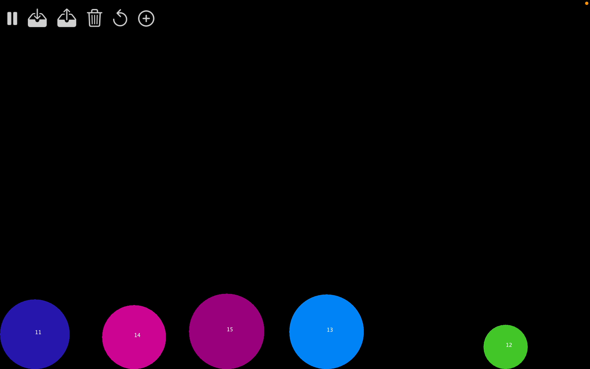
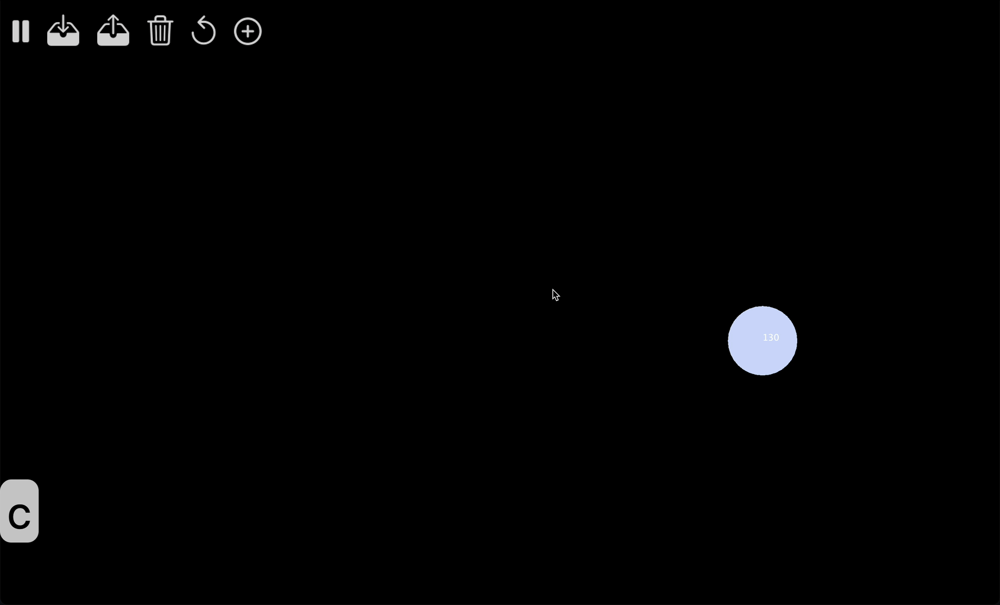

## Sandbox

    

        
        
  

    

A 2d sandbox environment in Java, tested using JUnit.

## Functionality

 Add Items

    

    

 Delete Items

    

 Launch Items

    

 Throw Items

    

 Play/Pause 

    

 Save/Load

    

## Design

    

        
        
 UML Diagram 

    

<!-- 

    

        
        
 Add Items 1 

    

    

        
        
 Add Items 2 

    

    

        
        
 Delete Items 

    

    

        
        
 Launch Items 

    

    

        
        
 Throw Items 

    

    

        
        
 Play/Pause 

    

    

        
        
 Save/Load 

    

 -->
